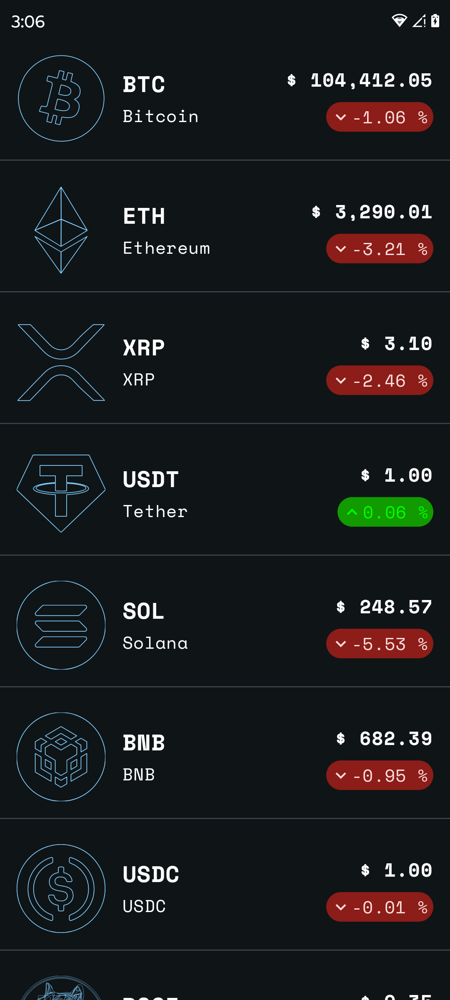

# CryptoCosmos 🚀

CryptoCosmos is a modern Android application that provides real-time cryptocurrency market data using the CoinCap API. Built with Jetpack Compose and following clean architecture principles, it offers a seamless and responsive user experience for tracking cryptocurrency prices and market information.

## Features 🌟

- Real-time cryptocurrency price tracking
- Detailed coin information including market cap and 24h price changes via a line chart
- Adaptive UI layout for different screen sizes
- Material Design 3 theming with dark mode and dynamic color support
- Edge-to-edge design
- Responsive and smooth animations

## Screenshots 📱

| Home Screen | Detail Screen |
|------------|---------------|
|  |  |

## Tech Stack 🛠️

### Core
- Kotlin
- Jetpack Compose
- Material Design 3
- Adaptive Navigation Components

### Architecture & Design Patterns
- Clean Architecture
- MVI (Model-View-Intent)
- Repository Pattern
- Dependency Injection with Koin

### Networking & Data
- Ktor Client for API communication
- Kotlinx Serialization
- CoinCap API integration

### State Management & UI
- Kotlin Flow
- Lifecycle Components
- Compose State Management
- Adaptive Layout Components

### Build & Tools
- Gradle Version Catalogs
- Android Studio Hedgehog
- Kotlin 2.0
- Minimum SDK: 26 (Android 8.0)
- Target SDK: 35

## Setup & Installation 🚀

1. Clone the repository
```bash
git clone https://github.com/yourusername/CryptoCosmos.git
```

2. Open the project in Android Studio Hedgehog or later

3. Build and run the application

## Contributing 🤝

Contributions are welcome! Please feel free to submit a Pull Request.

1. Fork the project
2. Create your feature branch (`git checkout -b feature/AmazingFeature`)
3. Commit your changes (`git commit -m 'Add some AmazingFeature'`)
4. Push to the branch (`git push origin feature/AmazingFeature`)
5. Open a Pull Request

## License 📝

This project is licensed under the MIT License - see the LICENSE file for details.

## Acknowledgments 👏

- CoinCap API for providing cryptocurrency market data
- Material Design 3 for modern UI components
- Android team for Jetpack Compose